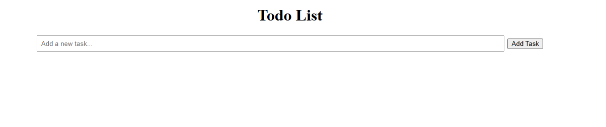
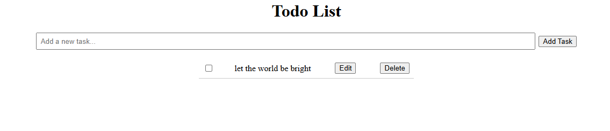
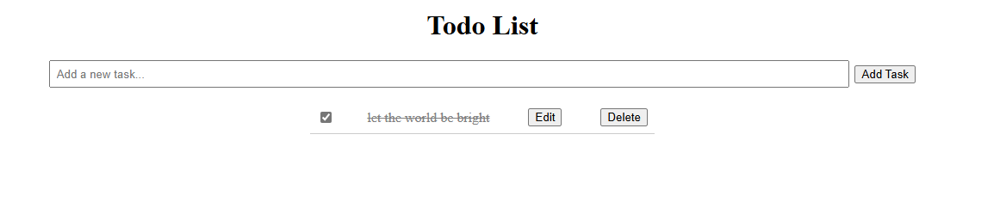
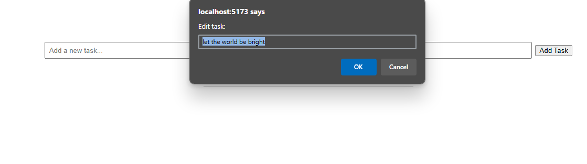

# Todo List App

A simple Todo List application built with React and TypeScript.

## Features

- Add new tasks
- Edit existing tasks
- Delete tasks
- Mark tasks as completed

## Installation

1. Clone the repository
2. Install dependencies: `npm install`
3. Start the development server: `npm start`

## ScreenShots

